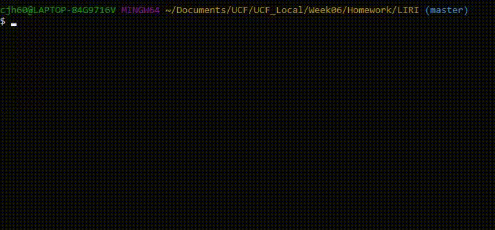
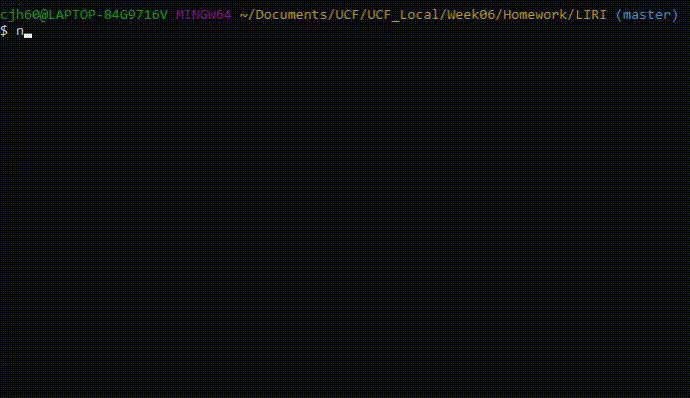
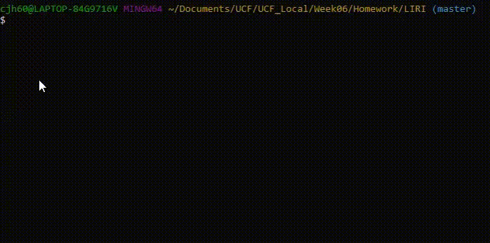

# LIRI Node App
## LIRI is a SIRI like program that runs inside of the terminal. It utilizes node and many npm's
With LIRI, you can spotify a song, search for a movie on omdb, search for concerts from you favorite artist!

## Using spotify-this-song command

## Using movie-this command

## Using concert-this command

## Using do-what-it-says command

## Thank You For Looking At My Repo!